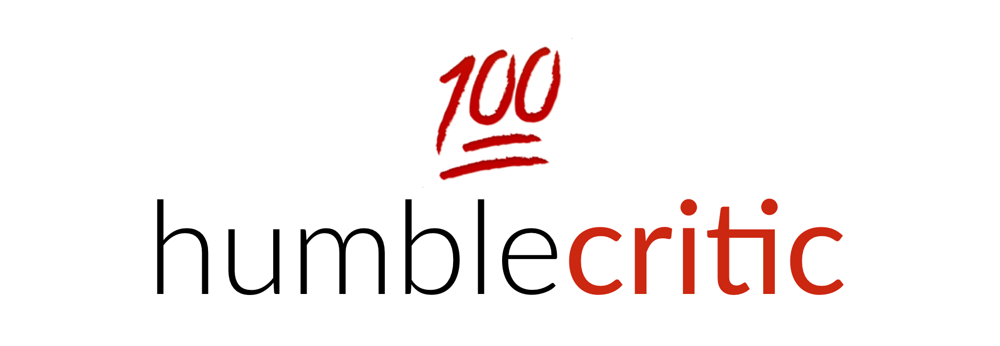

<p align=center>
<a href="">

</a>
</p>
<p align=center>
<a href="">

</a>
</p>

💯 Get score for HumbleBundle bundle

#### Bundles supported:

- [x] Book bundle (ratings from [Goodreads](goodreads.com))
- [x] Comic bundle (ratings from [Goodreads](goodreads.com))
- [ ] Game bundle
- [ ] Software bundle
- [ ] Mobile bundle

## Installation

Clone this repository and from the project directory run install.sh

```
$ ./install.sh
```

And thats basically it.

Note: To access some services (like goodreads) the script needs to have api keys. You will be promped to pass these in if needed.

## Usage

The installation process will supply entry point for the script so you can run it like so

```
$ humblecritic [-h] [-l [urls]] [-j file] [-v]
```

Add one or more option from below for customised behaviour:

- `-h, --help` Display help message and exit.

- `-l, --link [urls]` URL's for HumbleBundle bundles to be scraped and reviewed.

- `-j, --json scraped-data.json` Export scraped data to json.

- `-v, --version` Print the script version.

NOTE: Current version requires `-l` option with desired bundle urls for any results.

## Contents

I've tried to break down the logic to modules so I can easily extend the functionality in the future (ex. by supporting game bundles and getting reviews from metacritic.com).

```
.
├── LICENSE
├── README.md
├── humblecritic
│   ├── __init__.py
│   ├── __main__.py
│   ├── config.py
│   ├── goodreads
│   │   ├── __init__.py
│   │   ├── book.py
│   │   └── client.py
│   ├── humblebundle
│   │   ├── __init__.py
│   │   ├── builder.py
│   │   ├── bundle.py
│   │   ├── item.py
│   │   ├── scraper.py
│   │   └── tier.py
│   └── review.py
├── install.sh
├── logo.png
├── requirements.txt
├── setup.py
└── tests
    ├── __init__.py
    ├── context.py
    └── humblebundle_test.py
```
